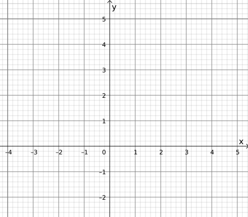
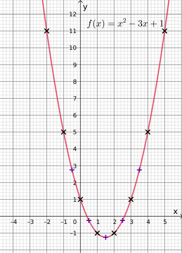

# Gleichungen, Funktionen und Graphen

## Was ist eine Gleichung?

Links und rechts eines Gleichheitszeichens steht ein mathematischer **Term**, z.B.:

 - $a + 2b = 4$

 - $-x^2 = 3(x - 2)$

Ein **Term** besteht aus Zahlen, Buchstaben und Rechenoperationen. Die Buchstaben sind „Platzhalter“ für Zahlen und haben in der Mathematik je nach Anwendung verschiedene Namen: Unbekannte, Variable, Konstante, Parameter, usw.

## Was bedeutet es, eine Gleichung zu lösen?

Anhand verschiedener Rechentechniken findet man Werte für die Unbekannte, damit die Gleichung „aufgeht“. Das heißt, damit die linke Seite den gleichen numerischen Wert wie die rechte Seite hat. Im Normalfall bedeutet das, dass am Ende diese Werte angegeben werden, z.B.:

 - $x=3\quad$ (eine Lösung) oder

 - $t_1 = 3 + \sqrt 2 \quad$ und $\quad t_2 = 3 - \sqrt 2 \quad$ (zwei Lösungen).

Wenn eine Gleichung mehr als eine Unbekannte hat, kann man normalerweise keine eindeutige Lösung finden – oft gibt es unendlich viele mögliche Lösungen. In diesem Fall kann man die Gleichung als Beschreibung einer *Beziehung* zwischen den Unbekannten betrachten. Siehe dazu das Thema **Gleichungssysteme**.

## Was ist eine Funktion?

Eine Funktion ist grundsätzlich eine Zuordnung. Man kann sich eine Maschine mit Eingabe und Ausgabe vorstellen. Irgendetwas gibt man ein und laut einer festen Umwandlungsvorschrift wird dann etwas anderes ausgegeben. In der Mathematik werden normalerweise numerische Zuordnungen benutzt – aus einer Zahl entsteht durch ein konkretes Rechenverfahren eine andere Zahl. Dieses Rechenverfahren beschreibt man durch einen mathematischen Term, z.B.:

 - $f(x) = x + 1$

 - $g(x) = -x^2 + 3x - 5$

Diese sind trotz des Gleichheitszeichens nicht Gleichungen! Sie sind *Definitionen*.  Die Form „$f(x) = \dots$“ ist eine feste Schreibweise. Auf der linken Seite wird der Name der Funktion (hier $f$ bzw. $g$) angegeben. Auch der Buchstabe, der für den Eingabewert steht, wird angegeben (hier $x$). Das $x$ heißt hier *Variable*.

Es gibt eine alternative Schreibweise für Funktionsdefinitionen, die die Zuordnung besser darstellt:

$$f: x \mapsto x + 1$$

Leider wird diese Schreibweise nicht so oft verwendet.

Eine Funktionsdefinition gibt an, was man mit dem Eingabewert tun muss, um den Ausgabewert zu errechnen. Für $f(x) = x^2 - 3x + 1$ gilt, z.B.:

 - $f(0) = (0)^2 - 3·(0) + 1 = 1$

 - $f(2) = (2)^2 - 3·(2) + 1 = -1$

 - $f(-1) = (-1)^2 - 3·(-1) + 1 = 5$

## Funktionen, Gleichungen und Graphen

Um bestimmte Eigenschaften einer Funktion klarer darzustellen, kann man die Funktion für einen Bereich der Eingabewerte graphisch darstellen. Dafür wird ein *kartesisches Koordinatensystem* verwendet. Dieses hat zwei Achsen, die rechtwinklig zueinander stehen.

Für die Eingabewerte wird die waagerechte Achse benutzt, für die Ausgabewerte die senkrechte. Da sehr häufig die Buchstaben *x* für Eingabe und *y* für Ausgabe verwendet werden, heißen diese Achsen oft die *x*-Achse und die *y*-Achse.

Eine Funktionsdefinition, z.B. $f(x) = x^2 - 3x + 1$, kann dementsprechend als Gleichung umgeschrieben werden:

$$y = x^2 - 3x + 1$$

Dieses ist jetzt wirklich eine Gleichung und man sie kann auch – bei Bedarf – umstellen, was für die erste Form ($f(x) = \dots$) keinen Sinn ergibt. Die beiden Formen sind allerdings für die meisten praktischen Zwecke gleichwertig und man geht mit den Begriffen recht locker um.

## Graphen zeichnen

Der volle Graph einer Funktion ist meistens unendlich groß: Die Eingabevariable, häufig *x*, kann oft jeden Wert zwischen Minus-Unendlich und Plus-Unendlich annehmen ($-\infty < x < \infty$), was als Zeichnung nicht praktisch zu realisieren ist.

Um die Haupteigenschaften zu zeigen, muss der Ausschnitt des vollen Graphen sinnvoll gewählt werden. Das ist nicht immer einfach, aber eine Aufgabe gibt oft den zu berücksichtigen Bereich an.

Die zugrundeliegende Idee eines Funktionsgraphen ist, dass eine Kurve gezeichnet wird. Jeder Punkt dieser Kurve stellt ein Wertepaar $(x \mid y)$ dar, sodass die *x*-Koordinate des Punktes einen Eingabewert und die *y*-Koordinate den entsprechenden Ausgabewert der Funktion darstellt.

Es können auch nicht alle Punkte eines Graphen berechnet und eingezeichnet werden, da es unendlich viele Punkte gibt, egal wie klein der Bereich ist.

Man braucht letztlich genug Punkte, um dann freihand eine glatte – nicht eckige – Kurve zu zeichnen. Die Punkte kann man in eine „Wertetabelle“ eintragen. Um Zeit zu sparen, ist es meistens sinnvoll die Berechnungen mit der Tabellenfunktion (o.Ä.) eines Taschenrechners auszuführen.

### Wertetabelle

Für die Funktion $f$ mit $f(x) = x^2 - 3x + 1$ könnte man den Bereich $-2 \le x \le 5$ wählen. Mit „Schrittlänge“ 1 ensteht die folgende Wertetabelle:

$$\begin{array}{c|c} 
\pmb x & \pmb y \\ \hline
-2 & f(-2) = (-2)^2 - 3·(-2) + 1 = 11 \\ \hline
-1 & f(-1) = (-1)^2 - 3·(-1) + 1 = 5 \\ \hline
0 & f(0) = (0)^2 - 3·(0) + 1 = 1 \\ \hline
1 & f(1) = (1)^2 - 3·(1) + 1 = -1 \\ \hline
2 & f(2) = (2)^2 - 3·(2) + 1 = -1 \\ \hline
3 & f(3) = (3)^2 - 3·(3) + 1 = 1 \\ \hline
4 & f(4) = (4)^2 - 3·(4) + 1 = 5 \\ \hline
5 & f(5) = (5)^2 - 3·(5) + 1 = 11 \\
\end{array}$$

Die Tabelle kann natürlich auch waagerecht sein und die Werte mit Taschenrechner berechnet:

$$\begin{array}{c|c|c|c|c|c|c|c|c} 
\pmb x & -2 & -1 & 0 & 1 & 2 & 3 & 4 & 5 \\ \hline
\pmb y & 11 & 5 & 1 & -1 & -1 & 1 & 5 & 11 
\end{array}$$

Insbesondere um den Scheitelpunkt herum gibt es noch nicht genug Punkte, um eine runde, glatte Kurve zu zeichnen. Wir berechnen also einige Zwischenstellen:

$$\begin{array}{c|c|c|c|c|c|c|c|c} 
\pmb x & -0{,}5 & 0{,}5 & 1{,}5 & 2{,}5 & 3{,}5 \\ \hline
\pmb y & 2{,}75 & -0{,}25 & -1{,}25 & -0{,}25 & 2{,}75
\end{array}$$

Aufgrund der Symmetrie können wir sehen, dass der Scheitelpunkt (hier ein Tiefpunkt) bei $(1{,}5 \mid -1{,}25)$ liegt.

Wenn die *Nullstellen* und *Extrempunkte* bekannt sind, ist es sinnvoll auch diese in das Koordinatensystem einzuzeichnen.

### Koordinatensystem zeichnen

Um die Werte der berechneten Tabelle im Koordinatensystem zu markieren, muss die *x*-Achse mindestens von $-2$ bis $5$ laufen. Für die *y*-Achse reicht $-2$ bis $11$.

Wenn nicht vorgegeben muss man die Größe des Koordinatensystems, Maßstäbe usw. sinnvoll festlegen. Häufig wird als Maßstab „1 Einheit $\widehat =$ 1 cm“ benutzt, die richtige Wahl hängt aber vom darzustellenden Bereich ab. Die zwei Achsen können auch unterschiedliche Maßstäbe haben.

Die Achsen müssen beschriftet werden: mit Einheiten (falls vorhanden, aber zumindest „x“, „y“, usw.) und Nummerierung.

### Punkte markieren und verbinden

Die „Zwischenpunkte“ sind hier anders markiert (um sie hervorzuheben), aber das würde man normalerweise nicht tun.

Nachdem die Kurve mit Bleistift gezeichnet wurde, kann es
gegebenenfalls sinnvoll oder erforderlich sein, die Kurve farbig zu gestalten. Die Funktionsvorschrift, oder zumindest der Funktionsname (hier $f$), sollte auch angegeben werden.

- - -
*letzte Änderung*: 14.09.2019
