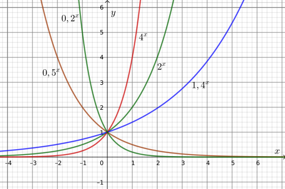

# Die Exponentialfunktion

Eine Exponentialfunktion hat die Grundform $f(x)=b^x$, wobei $b>0$, $b\neq{}1$.

Im unten stehenden Koordinatensystem werden die Graphen einiger Exponentialfunktionen mit verschiedenden $b$-Werten graphisch dargestellt:

 - Alle Funktionen dieser Form gehen durch den Punkt $(0 \mid 1)$; an dieser Stelle haben sie aber unterschiedliche Steigungen.
 
 - Alle haben die Asymptote $y=0$, mit Wertebereich $y>0$: Der Funktionswert ist nie negativ.
 
  - Für $b<1$ fällt der Graph streng monoton, für $b>1$ steigt der Graph streng monoton.
  
 - Anhand des Potenzgesetzes $b^{-n}=\frac{1}{b^n}=(\frac{1}{b})^n$ ist es klar, dass z. B. $0{,}5^x$ auch als $2^{-x}$ geschrieben werden kann: Die fallenden Graphen sind Spiegelbilder der entsprechenden steigenden Graphen an der $y$-Achse.

## Die Funktion $e^x$
Für einen bestimmten $b$-Wert hat der Graph die Steigung $1$ an der Stelle $x=0$.

Diese besondere Basis heißt „$e$“, mit Wert $e = 2,71828...$

Eine sehr praktische Eigenschaft dieser besonderen Basis ist, dass die Ableitung der Funktion $f(x)=e^x$ einfach durch $f'(x)=e^x$ gegeben ist! Diese ist die einzige Funktion mit dieser Eigneschaft (bis auf Verschiebungen).

Die eulersche Zahl „$e$“ ist, wie $\pi$, eine ganz besondere Zahl. Sie gehört zu den wichtigsten Konstanten der Mathematik und spielt in vielen Bereichen eine Rolle. Es gibt mehrere Möglichkeiten, diese Zahl zu definieren, zwei sind hier angegeben:

 - $e=\lim\limits_{n\to\infty} (1+\frac{1}{n})^n$

 - $e=\sum\limits_{n=0}^{\infty} \frac{1}{n!}$

### Basis umrechnen

Um eine Exponentialfunktion mit Basis $b$ in eine mit Basis $e$ umzurechnen, verwenden wir die Umkehrfuntion (den natürlichen Logarithmus, „$\ln$“):

$$b=e^{\ln (b)} \quad⇒\quad a · b^x = a · e^{\ln (b) · x}$$

## Funktionsbestimmung mit Exponentialfunktionen

### Beispiel 1

Bestimmen Sie die Gleichung einer Exponentialfunktion, deren Graph durch die Punkte $(0 \mid 3)$ und $(5 \mid 21{,}7)$ verläuft.

Die Angaben können als Funktionswerte geschrieben werden: $f(0) = 3$; $f(5) = 21{,}7$

**Ansatz (a):** $f(x) = a · b^x$

Der Anfangswert $a$ ist schon bekannt, also
$f(x) = 3 · b^x$.

Für $f(5)$:

\begin{align}
3 · b^5 &= 21{,}7 \nonumber\\
    b^5 &= \frac{21{,}7}{3} \nonumber\\
      b &= \sqrt[5]{\frac{21{,}7}{3}} \nonumber\\
        &\approx 1{,}485 \nonumber
\end{align}

$$⇒\quad f(x) = 3 · 1{,}485^x$$

**Ansatz (b):** $f(x) = a · e^{k · x}$

Für $f(5)$:

\begin{align}
3 · e^{5k} &= 21{,}7 \nonumber\\
    e^{5k} &= \frac{21{,}7}{3} \nonumber\\
      5k &= \ln\frac{21{,}7}{3} \nonumber\\
       k &= \frac{1}{5} · \ln\frac{21{,}7}{3} \nonumber\\
         &\approx 0{,}3957 \nonumber
\end{align}

$$⇒\quad f(x) = 3 · e^{0{,}3957 · x}$$

### Beispiel 2

Bestimmen Sie die Gleichung einer Exponentialfunktion, deren Graph durch die Punkte $(2 \mid 8{,}5)$ und $(7 \mid 3{,}4)$ verläuft.

Angaben als Funktionswerte: $f(2) = 8,5$; $f(7) = 3{,}4$

Hier wissen wir den Anfangswert nicht, wir müssen also ein Gleichungssystem lösen.

**Ansatz (a):** $f(x) = a · b^x$

\begin{align}
I \quad & a · b^2 = 8{,}5 \nonumber\\
II \quad & a · b^7 = 3{,}4 \nonumber
\end{align}

Gleichung $I$ nach $a$ umstellen:

$$a = \frac{8{,}5}{b^2}$$

Diesen Term in Gleichung $II$ einsetzen:

\begin{align}
\frac{8{,}5}{b^2} · b^7 &= {3{,}4} \qquad | :8{,}5 \nonumber\\
b^5 &= \frac{3{,}4}{8{,}5} \nonumber\\
b   &= \sqrt[5]{\frac{3{,}4}{8{,}5}} \nonumber\\
    &\approx 0{,}8326 \nonumber
\end{align}

Mit der umgestellten Gleichung $I$ können wir jetzt $a$ berechnen:

\begin{align}
a &\approx \frac{8{,}5}{0{,}8326^2} \nonumber\\
         &\approx 12{,}26 \nonumber
\end{align}

$$⇒\quad f(x) = 12{,}26 · 0{,}8326^x$$

**Ansatz (b):** $f(x) = a · e^{k · x}$

\begin{align}
I \quad & a · e^{2k} = 8{,}5 \nonumber\\
II \quad & a · e^{7k} = 3{,}4 \nonumber
\end{align}

Gleichung $I$ nach $a$ umstellen:

$$a = \frac{8{,}5}{e^{2k}}$$

Diesen Term in Gleichung $II$ einsetzen:

\begin{align}
\frac{8{,}5}{e^{2k}} · e^{7k} &= 3{,}4 \qquad | :8{,}5 \nonumber\\
e^{5k} &= \frac{3{,}4}{8{,}5} \nonumber\\
5k   &= \ln {\frac{3{,}4}{8{,}5}} \nonumber\\
k    &\approx -0{,}1833 \nonumber
\end{align}

Und für $a$:

\begin{align}
a & \approx \frac{8{,}5}{e^{-0{,}1833 · 2}} \nonumber\\
  & \approx 12{,}26 \nonumber
\end{align}

$$⇒\quad f(x) = 12{,}26 · e^{-0{,}1833 · x}$$

