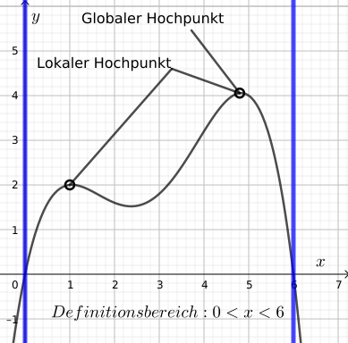
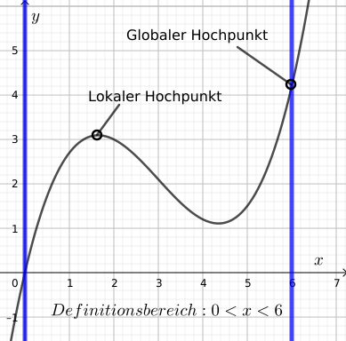
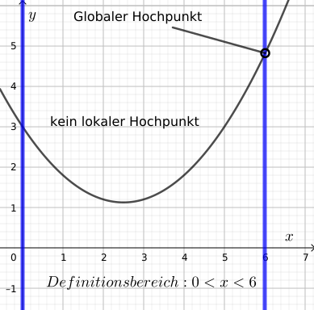
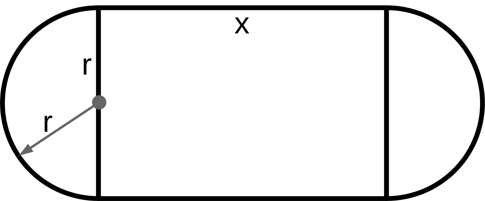
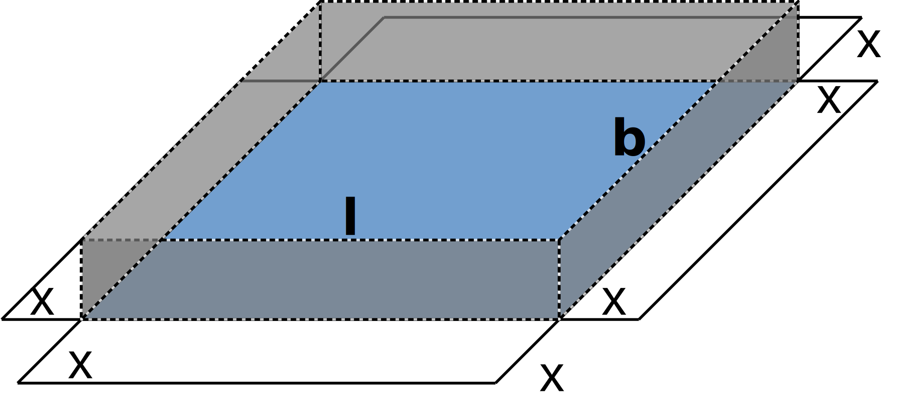
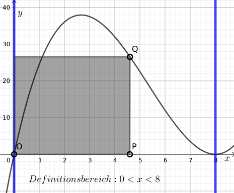

# Extremwertaufgaben (Optimierung)

Es geht bei Extremwertaufgaben darum, den Maximalwert (oder Minimalwert) einer Größe zu bestimmen bzw. einen Parameterwert zu bestimmen, sodass eine Größe einen Extremalwert annimmt. Im Folgenden werden nur Maximierungen betrachtet, die Ansätze sind aber genauso geeignet für Minimierungsaufgaben.

Um einen Maximalwert zu bestimmen, geht man folgenderweise vor:

1. Einen Funktionsterm für die zu maximierende Größe bestimmen.

2. Den globalen Hochpunkt des Funktionsgraphen bestimmen:

    - Die lokalen Hochpunkte bestimmen. Falls es mehr als einen Hochpunkt gibt, wird der höchste genommen.

    - Die Randwerte bestimmen. Das sind die Funktionswerte an den Enden des Definitionsbereiches der Funktion. Falls einer dieser Randwerte größer als das größte lokale Maximum ist, gilt dieser Randwert als das globale Maximum.

Falls ein Minimalwert zu bestimmen ist, wird man natürlich den globalen Tiefpunkt bestimmen.

In Testaufgaben sind die Randwerte sehr oft null. Man sollte diese trotzdem angeben – die Randwertuntersuchung gehört zum vollständigen Lösungsansatz!

### Beispielgraphen

Das **globale Maximum** ist der höchste Punkt im Definitionsbereich.

Unter Umständen kann einer der Randwerte einen größeren Wert als alle lokalen Hochpunkte annehmen.

Es ist auch möglich (aber vielleicht unwahrscheinlich), dass es im Definitionsbereich gar keine lokalen Hochpunkte gibt.

## Definitionsbereich

Normalerweise wird in einer Extremwertaufgabe ein beschränkter Bereich für den $x$-Wert angegeben. Oft – wie bei den Beispielaufgaben unten – ist der Deinitionsbereich durch die physikalische Beschaffenheit der beschriebenen Situation bestimmt.

## Nebenbedingungen

Je nach Aufgabenstellung und Bearbeitungsansatz kann der zu maximierende Term mehr als einen Parameter enthalten. In diesem Fall müssen auch sogenannte Nebenbedingungen als Gleichungen formuliert werden. Diese Nebenbedingungen entstehen aus der Aufgabenstellung und stellen Beziehungen zwischen den Parametern dar (siehe die Beispielaufgaben unten). Indem diese Nebenbedingungen in den zu maximierenden Term eingesetzt werden, wird die Anzahl der Parameter auf eins reduziert.

## Beispielaufgaben

### Laufbahn

Ein Stadion mit 440m-Laufbahn soll so angelegt werden, dass die Fläche des eingeschlossenen Rechtecks möglichst groß wird.

Der Flächeninhalt des Rechtecks wird anhand der Gleichung $A = 2r · x$ angegeben.

Als Nebenbedingung haben wir die Gesamtlänge der Laufbahn: $2\pi r + 2x = 440$.

Die Nebenbedingung können wir nach $r$ umstellen: $r = \frac{1}{\pi}(220 - x)$.

Durch einsetzen in die Flächengleichung bekommen wir einen Term für den Inhalt des Rechtecks, der nur einen Parameter hat. Der Flächeninhalt des Rechtecks kann durch die folgende Funktion $A$ dargestellt:

$$A(r) = \frac{2x}{\pi}(220 - x)$$

Der Definitionsbereich wird durch die beiden Extremalmöglichkeiten für die Beschaffenheit des Stadions („kurz und dick“ oder „lang und dünn“) bestimmt: $x=0$ und $x=220$. Das sind die Nullstellen der Flächenfunktion. Die Randwerte sind also für das Maximum nicht weiter zu berücksichtigen.

Der Hochpunkt des Graphen der Funktion $A$ ist $H(110 \mid 7703{,}09 ...)$.

$$r = \frac{1}{\pi}(220 - 110) = 35{,}014 ...$$

Das größte Rechteck wird mit $x = 110 m$ und $r \approx 35{,}01 m$ erreicht. Der Flächeninhalt beträgt dann ca. $7703 m^2$.

### Schachtel

Aus einem rechteckigen Stück Karton mit Länge $30cm$ und Breite $20cm$ wird eine offene Schachtel hergestellt, indem an den Ecken Quadrate mit Seitenlänge $x$ ausgeschnitten werden; die überstehenden Teile werden dann hochgebogen (siehe Abbildung).

Für welchen Wert von $x$ wird das Volumen maximal?

Die Länge des Schachtels wird durch $l=30-2x$ gegeben, die Breite durch $b=20-2x$. Das sind die Nebenbedingungen.

Das Schachtelvolumen V berechnet
sich wie folgt:

$$V = l · b · x = (30-2x) · (20-2x) · x$$

Der sinnvolle Bereich für $x$ ist begrenzt durch das kleinste Eckquadrat ($x>0$) und das größte ($x<10$), das abgeschnitten werden kann). In beiden Grenzfällen ist das Volumen $0$.

Der Hochpunkt der Funktion $V$ mit $V(x) = x · (30-2x) · (20-2x)$ wird gesucht für $0 < x < 10$:

$$H(3{,}92375 \mid 1056{,}3 ...)$$

Das Volumen wird für $x \approx 3{,}92 cm$ maximal.

### Ein innermathematisches Beispiel

Gegeben ist die Funktion $f$ mit $f(x) = \frac12 x (x-8)^2$.

Ein Rechteck wird durch die Ecken $O(0 \mid 0)$, $P(u \mid 0)$ und $Q(u \mid f(u))$ für $0 < u < 8$ beschrieben.

Bestimmen Sie $u$, sodass der Flächeninhalt des Rechtecks maximal wird. Geben Sie diese Maximalfläche an.

Flächeninhalt: $A(u) =$ Grundseite · Höhe $= u · f(u)$

Der Hochpunkt ist $H(4 \mid 128)$.

Randwertuntersuchung: $f(0) = 0$; $f(8) = 0$.

Für $u = 4$ wird der maximale Flächeninhalt von $128$ *VE* erreicht.

- - -
*letzte Änderung*: 02.09.2019